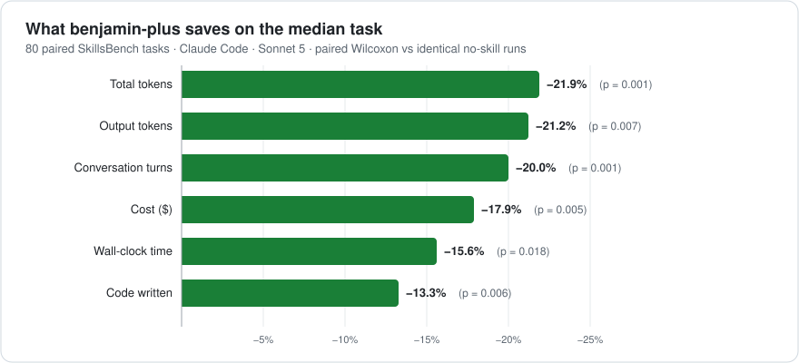
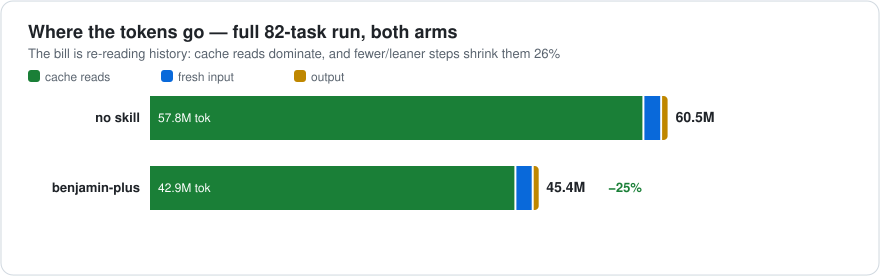

<p align="center">
  
</p>

<p align="center"><em>“Beware of little expenses; a small leak will sink a great ship.”</em><br>— Benjamin Franklin</p>

<h1 align="center">benjamin-plus</h1>

<p align="center">A token-efficiency <strong>skill</strong> for coding agents.<br>
It changes how the agent <strong>looks things up and waits</strong> — never what it builds.<br><br>
<strong>Measured: up to −18 % cost and −22 % tokens per task, quality unchanged.</strong></p>

---

## What the skill teaches

An agent pays twice for every clumsy lookup: once for the step itself, and again every time the growing conversation gets re-read. So the skill teaches five habits:

1. **Recon in one pass.** Gather the facts up front in one combined step instead of poking at the repo five separate times. And before copying a format or convention, look at two real examples, not one.
2. **Keyhole reads.** When the agent only needs to *see* something, it reads 50 lines, not the whole file. Data it will actually transform is never truncated.
3. **Probe the environment once.** Check every dependency in one command and install whatever is missing in one go, instead of discovering them one crash at a time.
4. **Green means the task's own check.** If the task says how to verify, that command is the definition of done. A missing compiler is still the agent's problem to fix, and a check that fails twice means the approach is wrong, not the symptom. When it passes: stop.
5. **Polling is a step.** A build that hasn't finished has nothing new to say. Check on it every 30 seconds, not every second. On some agent platforms, polling alone turned out to be nearly half of all steps.

The skill's full text: [`RULESET.md`](RULESET.md) (~745 tokens injected).

## What to expect





- **Quality unchanged.** 7 better / 5 worse / 68 ties (sign p = 0.77); mean verifier reward 0.362 → 0.392. Not powered as an equivalence test — large effects ruled out, small ones not.
- **Savings scale with baseline bloat.** An identical run a day earlier measured −10.0 % median cost against a leaner-running baseline; the treated arm stayed flat across both days while the control drifted +10.5 %. Expect roughly **−10 % to −18 % cost** depending on how bloated your sessions run.
- **Cross-platform:** on Java SWE-bench (Codex CLI, gpt-5.6-luna, 675 paired replicas) the hook-injected skill measured **−4.4 % cost [−7.5, −1.5], p = 0.003**, solve rate unchanged (p = 0.22), tool calls −20 %.
- Medians are the honest unit: a few hard-task tails can give part of the aggregate back.

## Install — inject it, don't "install" it

Same skill, two delivery methods, tested head-to-head: **injected, it saves** (−17.9 % cost median on the charts above; −4.4 % even on the harder Java/Codex setup) — **as a discoverable skill folder, it saves nothing** (−0.5 %, n.s.; agents burned steps just finding SKILL.md). So: inject.

```bash
git clone https://github.com/JetBrains/benjamin-plus-skill ~/.benjamin-plus
```

**Claude Code** — add to `~/.claude/settings.json` (verify with `/hooks`, or just ask Claude Code to add it):

```json
{ "hooks": { "SessionStart": [ { "matcher": "startup|resume|clear|compact",
  "hooks": [ { "type": "command", "command": "cat ~/.benjamin-plus/injected-instruction.md" } ] } ] } }
```

…or per-project, zero config: `cat ~/.benjamin-plus/injected-instruction.md >> CLAUDE.md`

**Codex CLI** — AGENTS.md is loaded into every session; no hook needed:

```bash
cat ~/.benjamin-plus/injected-instruction.md >> ~/.codex/AGENTS.md   # or >> AGENTS.md in a repo
```

**Any other agent** — append `injected-instruction.md` to the system prompt. That's the whole integration (~3 KB).

## How it was measured

Paired A/B: identical agent, model, tasks, and container images — the arms differ only by the injected ruleset. 80 paired SkillsBench tasks (Docker-sandboxed Claude Code 2.1.201, Sonnet 5, low effort), paired Wilcoxon on the deltas, sign test on rewards, per-trial adoption audits (injection 80/80 vs 0/80), one-sided failures retried before counting. Built in six iterations from trace-mining ~1,200 agent trials; every rule's target pool was measured before inclusion, and rules that traded quality for savings were deleted. Full write-up with every number and caveat: [`EXPECTED-RESULTS.md`](EXPECTED-RESULTS.md).

## Feedback

Found a regression, a workload where it loses money, or a rule that misfires on your stack? [Open an issue](../../issues) — ideally with the paired numbers (with/without) and, if you can, a trace. Results from other benchmarks and harnesses are especially welcome; that's how v6 got its polling rule.

## License

MIT.
